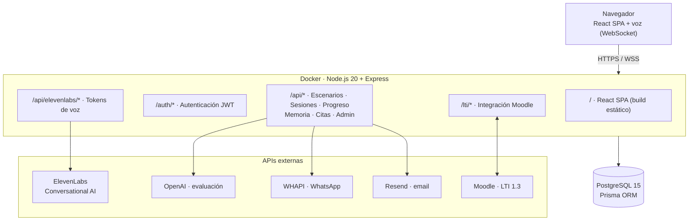

# Señoriales - Plataforma de Entrenamiento de Ventas

Plataforma de entrenamiento de ventas con IA conversacional.

## Arquitectura



> La arquitectura detallada (diagrama lógico, modelo de datos y despliegue) vive en la [wiki MkDocs](docs/index.md).

## Inicio Rápido

### Desarrollo Local

```bash
# 1. Clonar el repositorio
git clone <repository-url>
cd senoriales

# 2. Copiar variables de entorno
cp .env.example .env
# Editar .env con tus API keys

# 3. Iniciar con Docker Compose
docker-compose up --build

# 4. Abrir en navegador
open http://localhost:3000
```

### Solo Frontend (desarrollo)

```bash
npm install
npm run dev
```

### Solo Backend (desarrollo)

```bash
cd server
npm install
npm run dev
```

## Variables de Entorno

| Variable | Descripción | Requerida |
|----------|-------------|-----------|
| `JWT_SECRET` | Secreto para firmar tokens JWT | ✅ |
| `DATABASE_URL` | URL de conexión PostgreSQL | ✅ (o usar docker-compose) |
| `ELEVENLABS_API_KEY` | API key de ElevenLabs | ✅ |
| `ELEVENLABS_AGENT_ID` | ID del agente ElevenLabs | ✅ |
| `OPENAI_API_KEY` | API key de OpenAI (evaluaciones) | Opcional |
| `APP_URL` | URL pública de la aplicación | ✅ |
| `CORS_ORIGIN` | Orígenes permitidos para CORS | ✅ |

## Estructura del Proyecto

```
senoriales/
├── src/                    # Frontend React
│   ├── components/         # Componentes UI
│   ├── hooks/              # Custom hooks
│   ├── lib/                # Utilidades y API client
│   └── pages/              # Páginas/rutas
├── server/                 # Backend Express
│   ├── src/
│   │   ├── db/             # Schema y conexión DB
│   │   ├── middleware/     # Auth middleware
│   │   └── routes/         # API routes
│   ├── Dockerfile
│   └── package.json
├── Dockerfile              # Build unificado
├── docker-compose.yml      # Orquestación local
└── .env.example            # Template de variables
```

## Despliegue en Producción

Ver [docs/deployment.md](docs/deployment.md) para instrucciones detalladas de despliegue en Huawei Cloud o cualquier infraestructura con Docker.

> 📚 La documentación completa vive en `docs/` como una wiki MkDocs. Levántala con `mkdocs serve` (ver [docs/index.md](docs/index.md)).

## Comandos Útiles

```bash
# Construir imagen Docker
docker build -t senoriales .

# Ver logs
docker-compose logs -f app

# Reiniciar servicios
docker-compose restart

# Limpiar todo
docker-compose down -v
```

## API Endpoints

### Autenticación
- `POST /auth/signup` - Registro
- `POST /auth/login` - Login
- `POST /auth/logout` - Logout
- `POST /auth/refresh` - Refrescar token
- `GET /auth/me` - Usuario actual

### Escenarios
- `GET /api/scenarios` - Listar escenarios
- `GET /api/scenarios/:id` - Obtener escenario

### Sesiones de Práctica
- `GET /api/sessions` - Mis sesiones
- `POST /api/sessions` - Crear sesión
- `PATCH /api/sessions/:id` - Actualizar sesión
- `POST /api/sessions/evaluate` - Evaluar con IA
- `GET /api/sessions/stats` - Estadísticas

### ElevenLabs
- `POST /api/elevenlabs/conversation-token` - Token para conversación
- `POST /api/elevenlabs/scribe-token` - Token para transcripción
- `POST /api/elevenlabs/agent-evaluation` - Guardar evaluación del agente

## Licencia

Propietario - Capillas Señoriales
