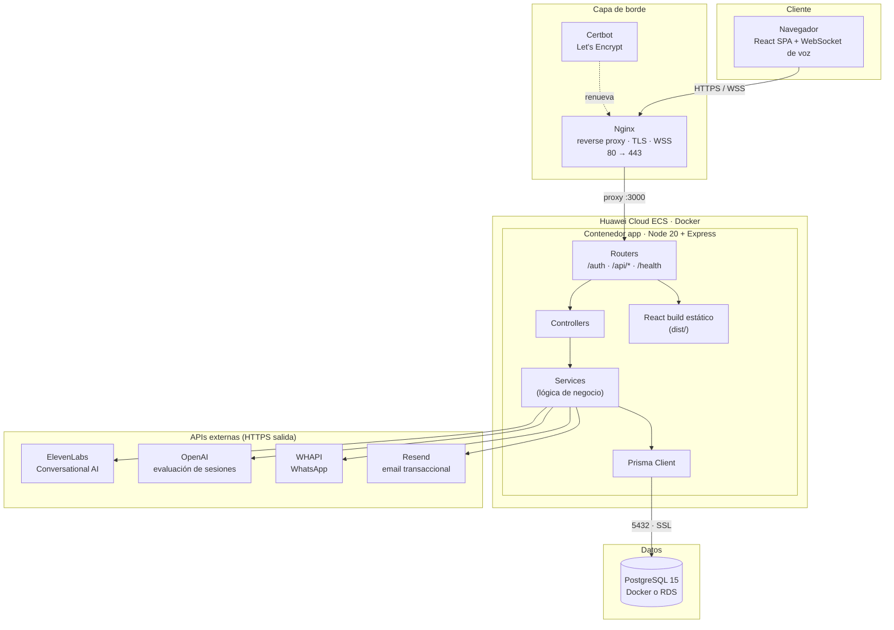
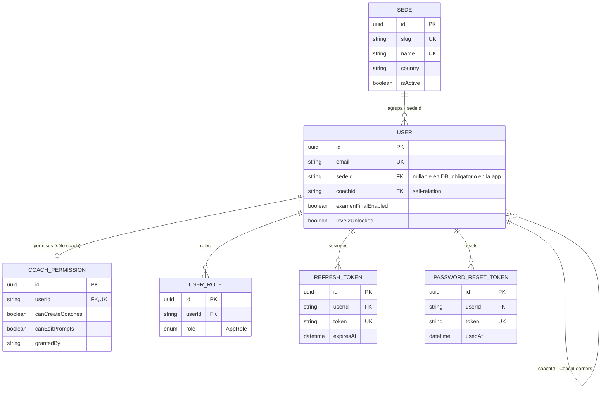
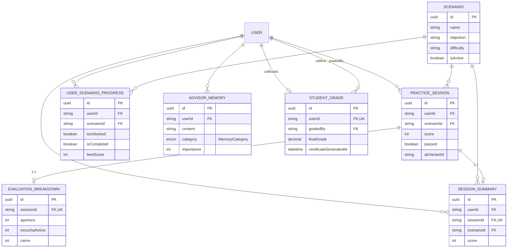
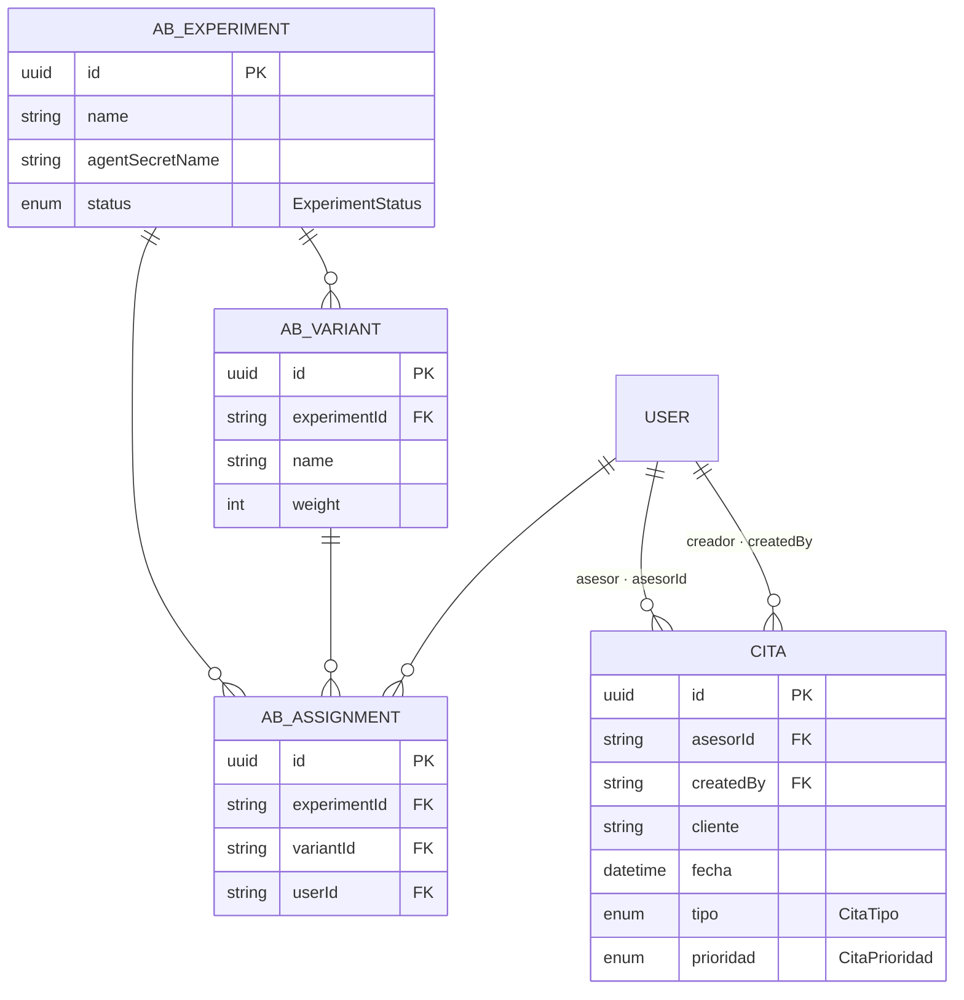

# Manual Técnico — Plataforma Señoriales

> Plataforma de entrenamiento de ventas con IA conversacional para Corporación Señoriales.
> Aplicación monolítica Node.js/Express + React SPA + PostgreSQL, desplegable en Docker.

| Campo | Valor |
|---|---|
| Versión del manual | 1.0 |
| Fecha | 2026-04-21 |
| Repositorio | `senoriales-48152aa7` (branch principal: `main`, desarrollo: `develop`) |
| Licencia | Propietario — Capillas Señoriales |
| Alcance | Componentes de aplicación, datos, 
integraciones, despliegue y operación |

---

## 1. Control de versiones del documento

| Versión | Fecha | Cambios | Responsable |
|---|---|---|---|
| 1.0 | 2026-04-21 | Versión inicial consolidada | Equipo técnico |

---

## 2. Arquitectura general

### 2.1 Diagrama lógico



### 2.2 Decisiones arquitectónicas clave

- **Monolito modular**: un solo proceso Node.js sirve API + SPA estática. Simplifica despliegue y reduce costos de infraestructura. Adecuado para el volumen objetivo (≤300 concurrentes).
- **Contenedorización Docker**: portable entre nubes (Huawei Cloud ECS es el target actual).
- **Base de datos relacional con Prisma**: esquema versionado, migraciones reproducibles.
- **Autenticación**: JWT local (email/password) con access + refresh tokens.
- **IA externa (ElevenLabs + OpenAI)**: sin modelos propios, reduciendo costos y complejidad. Riesgo: dependencia de terceros → mitigado con health checks y fallbacks.

---

## 3. Stack tecnológico

### 3.1 Frontend

| Capa | Tecnología | Versión |
|---|---|---|
| UI Framework | React | 18.3 |
| Bundler | Vite | 5.4 |
| Lenguaje | TypeScript | 5.8 |
| Ruteo | React Router | 6.30 |
| Estado servidor | TanStack Query | 5.83 |
| Estilos | Tailwind CSS | 3.4 |
| Componentes | shadcn/ui (Radix UI) | — |
| Formularios | React Hook Form + Zod | 7.61 / 3.25 |
| Voz (cliente) | `@elevenlabs/react` | 0.13 |
| 3D | three.js + @react-three/fiber | 0.183 / 9.5 |
| PDF | react-pdf, jspdf | 10.4 / 4.0 |
| Gráficas | Recharts | 2.15 |

### 3.2 Backend

| Capa | Tecnología | Versión |
|---|---|---|
| Runtime | Node.js | 20 LTS |
| Framework HTTP | Express | 4.18 |
| Lenguaje | TypeScript (ESM) | 5.3 |
| ORM | Prisma Client | 6.19 |
| BD | PostgreSQL | 15+ |
| Auth | JWT (jsonwebtoken) + bcryptjs | 9.0 / 2.4 |
| Seguridad HTTP | Helmet | 7.1 |
| CORS | cors | 2.8 |
| Dev | tsx (watch) | 4.6 |

### 3.3 Infraestructura

| Capa | Tecnología |
|---|---|
| Contenedorización | Docker + Docker Compose |
| Reverse proxy | Nginx (alpine) |
| TLS | Let's Encrypt vía Certbot |
| Target cloud | Huawei Cloud ECS + RDS PostgreSQL |

---

## 4. Organización del código

```
senoriales/
├── src/                          # Frontend React
│   ├── components/               # Componentes UI (practice/, scenarios/, ui/)
│   ├── hooks/                    # useAuth, useScenarios, useElevenLabsConversation, etc.
│   ├── lib/                      # api.ts (cliente REST), utils.ts
│   └── pages/                    # Auth, Index, Practice, Progress, Scenarios
│
├── server/                       # Backend Express
│   ├── src/
│   │   ├── config/               # Configuración centralizada (index.ts)
│   │   ├── controllers/          # Lógica HTTP por dominio
│   │   ├── services/             # Lógica de negocio (inyectable)
│   │   ├── routes/               # Definición de endpoints
│   │   ├── middleware/           # auth.ts (verificación JWT)
│   │   ├── db/                   # Cliente Prisma
│   │   ├── types/                # Tipos compartidos
│   │   ├── utils/                # AppError, helpers
│   │   └── index.ts              # Entry point Express
│   ├── prisma/
│   │   ├── schema.prisma         # Modelo de datos (fuente de verdad)
│   │   ├── seed.ts               # Seed de producción
│   │   └── seed-demo-data.ts     # Seed de demo
│   ├── public/documents/         # PDFs servidos a agentes (legado-vida.pdf)
│   └── DEPLOYMENT.md             # Guía específica Huawei Cloud
│
├── nginx/                        # Config reverse proxy + SSL
├── certbot/                      # Renovación automática TLS
├── docker-compose.yml            # Orquestación (app + db + nginx)
├── Dockerfile                    # Build unificado multi-stage
├── deploy.sh                     # Script de despliegue
├── init-ssl.sh                   # Inicialización de certificados
└── setup-cron.sh                 # Cron para renovación
```

### 4.1 Patrón de capas (backend)

```
Route → Controller → Service → Prisma → PostgreSQL
                       ↓
               (External APIs: elevenlabs, whapi, email)
```

- **Route**: solo declaración de endpoints y middleware.
- **Controller**: validación de entrada, orquestación HTTP, manejo de errores.
- **Service**: lógica de negocio pura, reusable, sin conocimiento HTTP.
- **Prisma**: acceso a datos tipado.

---

## 5. Modelo de datos

### 5.1 Dominios del esquema (Prisma)

| Dominio | Entidades principales |
|---|---|
| **Sedes (multi-tenant)** | `Sede`, `CoachPermission` — ver [Multi-sede](multi-sede.md) |
| **Usuarios y autenticación** | `User` (con `sedeId`, `coachId`), `UserRole`, `RefreshToken`, `PasswordResetToken` |
| **Escenarios y práctica** | `Scenario`, `PracticeSession`, `EvaluationBreakdown`, `UserScenarioProgress` |
| **Calificaciones** | `StudentGrade` |
| **Memoria del asesor** | `AdvisorMemory`, `SessionSummary` |
| **Citas (Coach Center)** | `Cita` |
| **Configuración de agentes** | `AgentConfig`, `ProspectingScenarioConfig`, `UserScenarioAccess` |
| **A/B Testing** | `AbExperiment`, `AbVariant`, `AbAssignment` |

### 5.2 Diagrama ER

> Fuente de verdad: `server/prisma/schema.prisma`. Los diagramas siguientes
> agrupan las entidades por dominio y muestran sólo los atributos clave
> (PK / UK / FK y campos representativos) para mantener la legibilidad.

#### 5.2.1 Identidad, sedes y acceso



#### 5.2.2 Escenarios, práctica, evaluación y memoria



#### 5.2.3 Coach Center, agentes y A/B Testing



!!! note "Tablas de configuración sin relaciones FK"
    `AgentConfig`, `ProspectingScenarioConfig`, `UserScenarioAccess` y
    `PricingRate` no declaran relaciones Prisma: son tablas de configuración /
    catálogo que se consultan por `secretName`, `userId` o `service` sin FK.
    `PricingRate` alimenta el panel de costos en `/admin/analytics`.

### 5.3 Enums principales

- `AppRole`: `admin`, `instructor`, `learner`, `coach`
- `MemoryCategory`: `debilidad`, `fortaleza`, `expresion`, `comportamiento`, `progreso`
- `ExperimentStatus`: `draft`, `active`, `completed`
- `CitaTipo`: `presencial`, `virtual`, `telefonica`
- `CitaPrioridad`: `alta`, `media`, `baja`

### 5.4 Migraciones

```bash
cd server
npx prisma migrate deploy      # Aplica migraciones pendientes (producción)
npx prisma migrate dev         # Crea nueva migración (desarrollo)
npx prisma db push             # Sync rápido del schema (solo dev)
npx prisma studio              # UI de exploración de datos
npm run db:seed                # Datos semilla de producción
npm run db:seed-demo           # Datos semilla demo
```

---

## 6. API — endpoints principales

### 6.1 Autenticación (`/auth`)

| Método | Ruta | Propósito | Auth |
|---|---|---|---|
| POST | `/auth/signup` | Registro de usuario | — |
| POST | `/auth/login` | Login email/password | — |
| POST | `/auth/logout` | Cierra sesión (invalida refresh) | Bearer |
| POST | `/auth/refresh` | Renueva access token | Refresh token |
| GET | `/auth/me` | Usuario actual | Bearer |
| POST | `/auth/forgot-password` | Envío de email de reset | — |
| POST | `/auth/reset-password` | Reset con token | Token |

### 6.2 API protegida (`/api/*`, Bearer JWT)

| Dominio | Rutas |
|---|---|
| Escenarios | `GET /api/scenarios`, `GET /api/scenarios/:id` |
| Sesiones | `GET/POST /api/sessions`, `PATCH /api/sessions/:id`, `POST /api/sessions/evaluate`, `GET /api/sessions/stats` |
| Progreso | `GET /api/progress`, `PATCH /api/progress/:scenarioId` |
| ElevenLabs | `POST /api/elevenlabs/conversation-token`, `POST /api/elevenlabs/scribe-token`, `POST /api/elevenlabs/agent-evaluation` |
| Memoria | `POST /api/memory/retrieve`, `POST /api/memory/save` (expuestos a agentes ElevenLabs) |
| Citas | `GET/POST /api/citas`, `PATCH/DELETE /api/citas/:id` |
| WhatsApp | `POST /api/whatsapp/agent-send` (expuesto a agentes ElevenLabs) |
| Admin | `/api/admin/*` (gestión de agentes, A/B, usuarios) |

### 6.3 Observabilidad

| Método | Ruta | Respuesta |
|---|---|---|
| GET | `/health` | `{status, timestamp, version, environment, services: {database, elevenlabs}}` |

---

## 7. Integraciones externas

### 7.1 ElevenLabs Conversational AI (obligatoria)

- **Uso**: motor de voz bidireccional para práctica de ventas.
- **Endpoints consumidos**:
  - `POST /v1/convai/conversation/get-signed-url` — token WebSocket de conversación.
  - Single-use token para transcripción en tiempo real (`realtime_scribe`).
- **Server Tools configurados en el agente** (llamados desde ElevenLabs → nuestro backend):
  - `retrieve_advisor_memory` → `POST /api/memory/retrieve`
  - `save_advisor_memory` → `POST /api/memory/save`
  - `send_whatsapp_message` → `POST /api/whatsapp/agent-send`
  - `submit_evaluation` → `POST /api/elevenlabs/agent-evaluation`
- **Agentes por modo** (env vars): Coach (default), Role-Play, Objeciones, Pitch, Cierre, Examen Final, 10+ agentes de Prospección.
- **Variables dinámicas del prompt**: `{{advisor_name}}`, `{{user_id}}`, `{{advisor_context}}` (se inyectan desde el frontend).

### 7.2 OpenAI (opcional)

- **Uso**: evaluación automática de sesiones (scoring de transcripciones).
- **Modelo por defecto**: `gpt-4o-mini`.
- **Fallback**: si `OPENAI_API_KEY` no está configurado, la evaluación queda deshabilitada (no bloquea sesiones).

### 7.3 WHAPI (WhatsApp no oficial)

- **Uso**: envío de mensajes y documentos (brochure "Legado de Vida") durante conversaciones.
- **Endpoint**: `https://gate.whapi.cloud`.
- **Documentos disponibles**: ver `AVAILABLE_DOCUMENTS` en `server/src/routes/whatsapp.ts`.

### 7.4 Resend (email transaccional)

- **Uso**: recuperación de contraseña, notificaciones.
- **Remitente por defecto**: `Señoriales <onboarding@resend.dev>` (sustituir por dominio verificado en producción).

---

## 8. Seguridad

### 8.1 Autenticación y sesión

- **Access Token JWT**: expira en 1 hora.
- **Refresh Token JWT**: expira en 7 días, almacenado en tabla `refresh_tokens` (revocable).
- **Hash de contraseñas**: bcryptjs.
- **Password reset**: token de un solo uso en tabla `password_reset_tokens`, expira y se marca con `used_at`.

### 8.2 Autorización

- **RBAC**: roles `admin`, `instructor`, `learner` en tabla `user_roles` (m:n con usuarios).
- **Middleware `auth`**: verifica Bearer token en rutas `/api/*` y adjunta `req.user`.
- **Algunas rutas son públicas intencionalmente** (ej. `/api/memory/retrieve`) porque son invocadas por agentes ElevenLabs externos; dependen del `user_id` pasado como parámetro y no contienen datos altamente sensibles.

### 8.3 Transporte

- HTTPS obligatorio en producción (Nginx + Let's Encrypt).
- `helmet` activado (CSP deshabilitado para SPA).
- CORS con lista explícita de orígenes (`CORS_ORIGIN` soporta comas).

### 8.4 Hallazgos abiertos (acción requerida)

> ⚠️ **Token WHAPI hardcodeado en `server/src/config/index.ts:54`**.
> Rotar en el proveedor, reemplazar por `process.env.WHAPI_TOKEN` sin fallback literal y auditar historial git para confirmar alcance de exposición. Ver runbook RB-06 "Rotación de secretos".

> ⚠️ **Valores por defecto permisivos en desarrollo**: `CORS_ORIGIN=*`, `JWT_SECRET='change-this-in-production'`. En producción `validateConfig()` ya los bloquea (`throw` en JWT), pero conviene revisar que ningún entorno intermedio los herede.

---

## 9. Configuración — variables de entorno

Ubicación esperada: `server/.env` (cargado por `dotenv`).

| Variable | Requerida | Descripción |
|---|---|---|
| `PORT` | — | Puerto interno (default 3000) |
| `NODE_ENV` | — | `production` habilita SPA estática, valida JWT fuerte |
| `APP_URL` | Sí (prod) | URL pública, debe ser HTTPS |
| `CORS_ORIGIN` | Sí | Orígenes permitidos, separados por coma |
| `DATABASE_URL` | Sí | Cadena PostgreSQL (`?sslmode=require` en RDS) |
| `JWT_SECRET` | Sí | ≥32 caracteres (`openssl rand -base64 32`) |
| `ELEVENLABS_API_KEY` | Sí | API key de ElevenLabs |
| `ELEVENLABS_AGENT_ID` | Sí | Agente Coach por defecto |
| `ELEVENLABS_AGENT_ROLEPLAY` | Opc | Role-play cliente simulado |
| `ELEVENLABS_AGENT_OBJECIONES` | Opc | Entrenamiento de objeciones |
| `ELEVENLABS_AGENT_PITCH` | Opc | Elevator pitch 60s |
| `ELEVENLABS_AGENT_CIERRE` | Opc | Técnicas de cierre |
| `ELEVENLABS_AGENT_EXAMEN_FINAL` | Opc | Evaluación sumativa |
| `ELEVENLABS_AGENT_PROSPECTING_*` | Opc | Escenarios de prospección (10+ variantes) |
| `OPENAI_API_KEY` | Opc | Evaluación IA |
| `OPENAI_MODEL` | Opc | Default `gpt-4o-mini` |
| `WHAPI_TOKEN` | Opc | Habilita envío por WhatsApp |
| `WHAPI_API_URL` | Opc | Default `https://gate.whapi.cloud` |
| `RESEND_API_KEY` | Opc | Habilita emails |
| `RESEND_FROM_EMAIL` | Opc | Remitente verificado |

Ver plantilla completa en `.env.example` (raíz del repo).

---

## 10. Despliegue

### 10.1 Docker Compose (producción recomendado)

Servicios definidos en `docker-compose.yml`:

| Servicio | Imagen | Puerto | Propósito |
|---|---|---|---|
| `app` | build local (Dockerfile) | 3000 (interno) | API + SPA estática |
| `db` | `postgres:15-alpine` | 5432 (interno) | Base de datos |
| `nginx` | `nginx:alpine` | 80, 443 | Reverse proxy + SSL |

Comandos:

```bash
# Primera vez
cp .env.example server/.env        # y completar valores
./init-ssl.sh                      # certificados Let's Encrypt
docker-compose up -d --build

# Migraciones de DB (primera vez o upgrade)
docker-compose exec app npx prisma migrate deploy

# Operación
docker-compose ps
docker-compose logs -f app
docker-compose restart app
```

### 10.2 Dimensionamiento

| Usuarios concurrentes | vCPU | RAM | Disco |
|---|---|---|---|
| 50 | 2 | 4 GB | 50 GB SSD |
| 150 | 4 | 8 GB | 100 GB SSD |
| 300+ | 8 | 16 GB | 200 GB SSD |

### 10.3 Red y puertos

| Puerto | Dirección | Uso |
|---|---|---|
| 80 | Entrante | Redirect a 443 + challenge certbot |
| 443 | Entrante | Tráfico web + WSS |
| 3000 | Interno | App Node |
| 5432 | Interno | PostgreSQL (solo app→db) |

**Salida requerida (443)**: `api.elevenlabs.io`, `api.openai.com`, `gate.whapi.cloud`, `api.resend.com`.

### 10.4 Certificados SSL

- Let's Encrypt con Certbot.
- `init-ssl.sh` emite certificado inicial.
- `setup-cron.sh` configura renovación automática (cada 12h comprueba vencimiento).
- Runbook RB-08 cubre el proceso completo.

---

## 11. Operación

### 11.1 Health check

```bash
curl https://tu-dominio.com/health
```

Respuesta correcta: `{"status":"ok", ...}`. Cualquier otra cosa es un incidente. Ver RB-01.

### 11.2 Logs

```bash
# Tiempo real
docker-compose logs -f app

# Solo errores
docker-compose logs app 2>&1 | grep -i error

# Nginx (accesos / errores de proxy)
docker-compose logs -f nginx
```

### 11.3 Backups

- **Recomendado**: `pg_dump` diario desde fuera del contenedor hacia un bucket externo.
- Si la DB corre en Docker: snapshot del volumen `postgres_data` antes de cualquier cambio mayor.
- Detalle operativo: ver runbook RB-05.

### 11.4 Monitoreo sugerido

| Métrica | Fuente | Umbral alerta |
|---|---|---|
| Disponibilidad `/health` | probe HTTP | 1 fallo en 2 min |
| CPU contenedor `app` | Docker stats / cloud | >80% 5 min |
| RAM contenedor `app` | idem | >85% 5 min |
| Conexiones PostgreSQL | `pg_stat_activity` | >80% de `max_connections` |
| Errores 5xx en Nginx | logs | tasa >1% en 5 min |
| Latencia ElevenLabs | logs aplicativos | p95 >3 s |

---

## 12. Glosario

| Término | Definición |
|---|---|
| **Asesor / Learner** | Usuario final que practica ventas |
| **Escenario** | Configuración de práctica (persona cliente + objeción + script) |
| **Sesión de práctica** | Conversación individual contra un agente IA |
| **Memoria del asesor** | Registro persistente de patrones detectados entre sesiones |
| **Server Tool (ElevenLabs)** | Función HTTP que el agente invoca durante la conversación |
| **SPA** | Single-Page Application (el frontend React) |
| **RDS** | Relational Database Service (PostgreSQL administrado en nube) |

---

## 13. Referencias del repo

- `README.md` — resumen y arranque rápido.
- `server/STACK.md` — detalle técnico del stack.
- `server/DEPLOYMENT.md` — guía específica de Huawei Cloud.
- `Integraciones.md` — paso a paso de ElevenLabs y WHAPI.
- `docs/RUNBOOKS.md` — procedimientos operativos (ITIL 4).
- `.env.example` — plantilla de variables de entorno.
