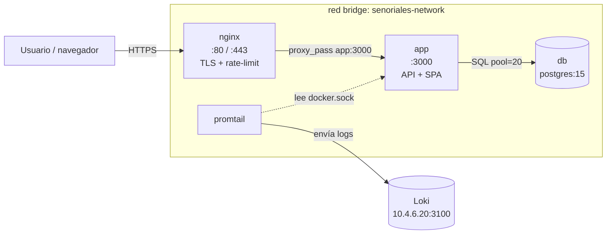
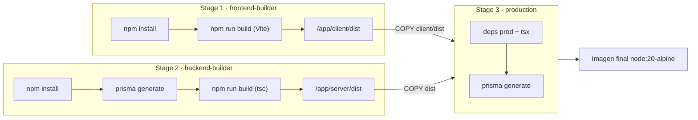
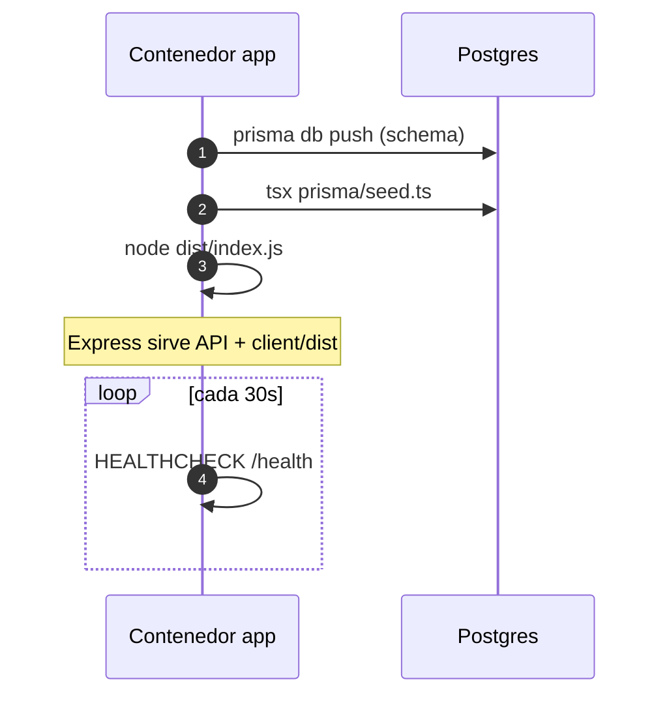
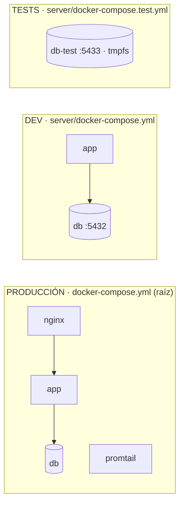
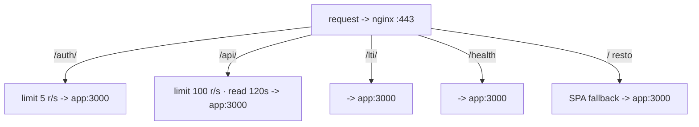

# Docker y Docker Compose — Arquitectura de Contenedores

Este documento describe **cómo está contenerizada** la aplicación Señoriales: los
Dockerfiles, los tres archivos `docker-compose` que existen en el repo y para qué
sirve cada uno. Para el **procedimiento de despliegue** paso a paso en Huawei Cloud
ver [`deployment.md`](./deployment.md).

!!! abstract "TL;DR"
    - **Producción** → `docker-compose.yml` (raíz) + `Dockerfile` (raíz). Stack completo: app unificada (frontend+backend) + Postgres + Nginx + Promtail.
    - **Backend aislado / dev** → `server/docker-compose.yml` + `server/Dockerfile`. Solo API + Postgres, sin Nginx ni frontend empaquetado.
    - **Tests** → `server/docker-compose.test.yml`. Solo un Postgres efímero en memoria para la suite de Vitest.

---

## 1. Vista general

La app es un **monolito**: un solo proceso Node/Express sirve la API **y** el
frontend React ya compilado (archivos estáticos). No hay contenedor separado para
el frontend en producción — Vite compila a estáticos que Express entrega desde
`client/dist`.



| Contenedor | Imagen | Responsabilidad |
|------------|--------|-----------------|
| `nginx` | `nginx:alpine` | Frente HTTP/HTTPS, TLS, rate-limit, reverse proxy |
| `app` | build local (unificada) | API Express + servir el SPA compilado |
| `db` | `postgres:15-alpine` | Persistencia |
| `promtail` | `grafana/promtail` | Recolección de logs hacia Loki |

---

## 2. Dockerfiles

### 2.1 `Dockerfile` (raíz) — imagen unificada de producción

Build **multi-stage** de 3 etapas que produce una sola imagen con backend + frontend.
Cada etapa compila por separado y la imagen final solo se queda con los artefactos
necesarios (imagen más pequeña, sin toolchain de build):



| Stage | Base | Qué hace |
|-------|------|----------|
| `frontend-builder` | `node:20-alpine` | `npm install` + `npm run build` del frontend (Vite). Salida: `/app/client/dist`. |
| `backend-builder` | `node:20-alpine` | Instala deps del backend, `npx prisma generate`, `npm run build` (tsc → `/app/server/dist`). |
| `production` | `node:20-alpine` | Deps de producción + `tsx`, regenera Prisma Client, copia `dist` del backend, copia `client/dist` del frontend, copia `public/audio`. |

**Arranque del contenedor** (`CMD`): no arranca el servidor directamente, primero
sincroniza el schema y siembra datos:



```sh
npx prisma db push --skip-generate --accept-data-loss \
  && tsx prisma/seed.ts \
  && node dist/index.js
```

- Expone el puerto **3000**.
- `HEALTHCHECK` golpea `http://localhost:3000/health` cada 30 s.
- El backend sirve los estáticos del frontend desde `../client/dist`
  (ver `server/src/index.ts`): `/assets`, `/audio` con cache de 30 días, y
  *fallback* SPA a `index.html`.

### 2.2 `server/Dockerfile` — imagen solo-backend

Build multi-stage de 2 etapas (`builder` + `production`) que empaqueta **únicamente**
la API. No incluye el frontend (la línea `COPY --from=client-builder` está comentada).
Se usa con `server/docker-compose.yml`. Arranca con `node dist/index.js`.

---

## 3. Los tres `docker-compose`

Cada archivo levanta una topología distinta para una etapa distinta del ciclo de vida:



### 3.1 `docker-compose.yml` (raíz) — PRODUCCIÓN

Stack completo. **Este es el que se usa en el servidor de producción.**

| Servicio | Imagen / Build | Puertos | Rol |
|----------|----------------|---------|-----|
| `app` | build con `Dockerfile` raíz | `3000:3000` | App unificada (API + SPA). Lee `./server/.env`. |
| `db` | `postgres:15-alpine` | *(interno)* | Base de datos. Volumen `postgres_data`. Puerto **no** expuesto. |
| `nginx` | `nginx:alpine` | `80:80`, `443:443` | Reverse proxy + TLS + rate limiting. Monta `./nginx/nginx.conf` y `./nginx/ssl`. |
| `promtail` | `grafana/promtail:3.3.0` | — | Envía logs de los contenedores a Loki (`10.4.6.20:3100`). |

Detalles relevantes:

- **Red:** todos en la red bridge `senoriales-network`.
- **`DATABASE_URL`** se fija inline con `connection_limit=20&pool_timeout=30`
  (el default 10 de Prisma satura con ~20 requests concurrentes → error P2024).
- **`CORS_ORIGIN`** incluye los dominios públicos + localhost.
- **`depends_on` con `condition: service_healthy`**: `app` no arranca hasta que el
  healthcheck de `db` (`pg_isready`) pasa.
- **Logging** limitado a 10 MB × 3 archivos por contenedor (json-file).
- El schema se aplica en runtime vía `prisma db push` (no monta `schema.sql`).

```bash
# Levantar producción
docker compose up -d --build
docker compose ps
docker compose logs -f app
```

### 3.2 `server/docker-compose.yml` — BACKEND AISLADO / DEV

Stack mínimo para correr **solo el backend** contra una Postgres local. Útil para
desarrollo del API o pruebas manuales sin Nginx ni frontend empaquetado.

| Servicio | Imagen / Build | Puertos | Notas |
|----------|----------------|---------|-------|
| `app` | build con `server/Dockerfile` | `3000:3000` | Toma vars del entorno (`JWT_SECRET`, `APP_URL`, `ELEVENLABS_*`). |
| `db` | `postgres:15-alpine` | `5432:5432` | **Expone 5432** (a diferencia de prod). Monta `./src/db/schema.sql` como init script. |

Diferencias clave vs. producción:

- **No** hay Nginx ni Promtail.
- Postgres **sí** expone `5432` al host (para conectarse con DBeaver, psql, Prisma Studio…).
- El schema se carga al iniciar montando `./src/db/schema.sql` en
  `/docker-entrypoint-initdb.d/` (relativo a `server/`, es decir `server/src/db/schema.sql`).
- `DATABASE_URL` sin tuning de pool.

```bash
cd server
docker compose up -d --build
```

### 3.3 `server/docker-compose.test.yml` — TESTS

Solo una Postgres **efímera** para la suite de Vitest. No incluye la app.

| Servicio | Imagen | Puertos | Notas |
|----------|--------|---------|-------|
| `db-test` | `postgres:15-alpine` | `5433:5432` | Puerto **5433** para no colisionar con el dev db (5432). |

- **`tmpfs: /var/lib/postgresql/data`** → la DB vive en RAM, se borra al apagar
  (rápida y sin estado entre corridas).
- Healthcheck agresivo (cada 2 s, 20 reintentos) para que los tests arranquen rápido.

Gestión vía scripts de `server/package.json`:

```bash
cd server
npm run test:db:up      # docker compose -f docker-compose.test.yml up -d --wait
npm run test:db:push    # aplica el schema con prisma db push (usa .env.test)
npm run test            # dotenv -e .env.test -- vitest run
npm run test:db:down    # docker compose -f docker-compose.test.yml down -v
```

Ver [`testing.md`](./testing.md) para el flujo completo de pruebas.

---

## 4. Tabla comparativa

| Aspecto | `docker-compose.yml` (raíz) | `server/docker-compose.yml` | `server/docker-compose.test.yml` |
|---------|------------------------------|------------------------------|----------------------------------|
| Propósito | Producción | Backend dev/aislado | Tests (Vitest) |
| Frontend incluido | ✅ (en imagen `app`) | ❌ | ❌ |
| Nginx + TLS | ✅ | ❌ | ❌ |
| Promtail/logs a Loki | ✅ | ❌ | ❌ |
| Postgres expuesto al host | ❌ | ✅ `5432` | ✅ `5433` |
| Persistencia DB | Volumen `postgres_data` | Volumen `postgres_data` | `tmpfs` (efímero) |
| Origen del schema | `prisma db push` en runtime | `schema.sql` como init | `prisma db push` (`.env.test`) |
| Dockerfile usado | `Dockerfile` (raíz, 3 stages) | `server/Dockerfile` (2 stages) | — (solo imagen oficial) |

---

## 5. Nginx (reverse proxy de producción)

`nginx/nginx.conf` define el frente HTTP/HTTPS. Por ruta aplica políticas distintas
antes de pasar todo a `app:3000`:



- **HTTP (80):** sirve el challenge de Certbot (`/.well-known/acme-challenge/`) y
  redirige todo lo demás a HTTPS (301).
- **HTTPS (443):** TLS 1.2/1.3 con certs en `/etc/nginx/ssl`, headers de seguridad
  (HSTS, X-Frame-Options, nosniff, etc.).
- **Rate limiting** por IP:
  - `auth` → 5 r/s (burst 10) — restrictivo contra credential stuffing.
  - `api` → 100 r/s (burst 200) — un admin abriendo el dashboard dispara ~6 requests.
  - Devuelve **429** al exceder.
- **Rutas proxeadas** a `app:3000`: `/auth/`, `/api/` (con timeouts largos: read 120s),
  `/lti/`, `/health`, y `/` como *fallback* SPA.
- `client_max_body_size 10M`.

---

## 6. Notas y gotchas

- **`docker-compose.yml` raíz vs. `server/docker-compose.yml`:** no se usan juntos.
  El de la raíz es el de producción (app unificada); el de `server/` es para
  desarrollo del backend. Lanzar ambos a la vez genera conflicto de puerto 3000.
- **El `.env` de producción** lo lee la app desde `./server/.env` (ver `env_file`
  en el compose raíz), aunque la imagen sea unificada.
- **`server/src/db/schema.sql`** solo se usa como init en el compose de `server/`.
  En producción el schema se materializa con Prisma (`db push`), no con ese SQL.
- **Promtail** apunta a Loki en `10.4.6.20:3100` (red interna Huawei). Si ese
  servidor de logs cambia, actualizar `promtail/promtail-config.yml`.
- **Cache busting de estáticos:** el backend cachea `/assets` y `/audio` 30 días;
  tras un deploy con cambios de frontend, los nombres de archivo hasheados por Vite
  evitan servir versiones viejas.
