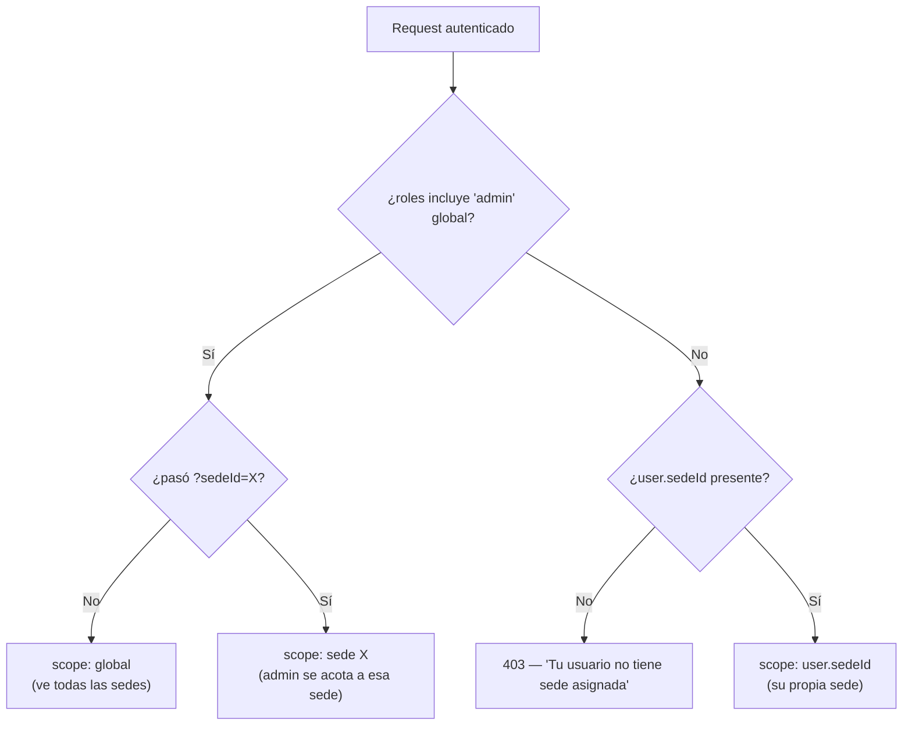

# Multi-sede (aislamiento por sede)

> Modelo de **tenancy ligero**: cada usuario pertenece a exactamente una **sede**
> (sucursal / ubicación) y el aislamiento de datos entre sedes es **duro**. Sólo
> el rol `admin` global puede atravesar sedes.

| Campo | Valor |
|---|---|
| Estado | Backend + frontend shipeados en `develop` |
| Entidades nuevas | `Sede`, `CoachPermission`, `User.sedeId`, `User.coachId` |
| Rol nuevo | `coach` (en enum `AppRole`) |
| Enforcement | Capa de aplicación (`getSedeScope`) + constraints de DB |

---

## 1. Concepto

El sistema pasó de una única organización implícita a un modelo de **múltiples
sedes** (p. ej. *Guatemala*, *Ciudad de México*, *Tapachula*). El principio rector:

- **Cada `User` pertenece a una sola sede** (`User.sedeId`).
- **Aislamiento duro**: un coach, instructor o learner sólo puede leer y mutar
  datos de su **propia** sede. No existe lectura cruzada entre sedes.
- **Sólo el `admin` global atraviesa sedes.** Puede ver todas o, opcionalmente,
  acotarse a una sede concreta pasando `?sedeId=X` en endpoints sede-aware.

!!! warning "El aislamiento se decide en la capa de aplicación"
    El motor de la separación es el helper `getSedeScope()` invocado por cada
    service. Los constraints de DB (`onDelete: Restrict` en `Sede`, índices por
    `sedeId`) son una red de seguridad, **no** el mecanismo primario. Cualquier
    query nueva sobre datos de usuarios debe pasar por el scope (ver §5).

---

## 2. Modelo de datos

### 2.1 Entidad `Sede`

```prisma
model Sede {
  id        String   @id @default(uuid())
  slug      String   @unique   // "guatemala", "cdmx", "tapachula"
  name      String   @unique   // "Guatemala", "Ciudad de México"
  country   String?            // "GT", "MX" — ISO opcional
  city      String?
  address   String?
  isActive  Boolean  @default(true)
  // ...
  users     User[]
}
```

- **`slug`** es la referencia estable para URLs y código (lowercase, alfanumérico
  y guiones, 2–64 chars). La UI puede mandar el `slug` **o** el UUID indistintamente.
- **`isActive`** permite *desactivar* una sede sin borrarla. Un slug viejo de una
  sede inactiva **no** resucita en signup (el lookup filtra por `isActive: true`).

### 2.2 Campos añadidos a `User`

| Campo | Tipo | Notas |
|---|---|---|
| `sedeId` | `String?` | **Nullable en DB**, obligatorio en la app (ver §6). FK con `onDelete: Restrict`. |
| `coachId` | `String?` | Auto-relación `CoachLearners`. Coach asignado al learner. `onDelete: SetNull`. |

!!! note "¿Por qué `sedeId` es nullable a nivel DB?"
    Para tolerar el **backfill** (usuarios viejos sin sede durante la migración) y
    para que un crash a mitad del seed no deje la app rota. La capa de aplicación
    trata la sede como **obligatoria**: todo `signup`/`createUser` exige `sedeId`,
    y `getSedeScope()` rechaza requests de un usuario sin sede asignada.

### 2.3 Rol `coach` y `CoachPermission`

Se agregó `coach` al enum `AppRole` (`admin`, `instructor`, `learner`, `coach`).
Los permisos granulares del coach viven en una tabla aparte:

```prisma
model CoachPermission {
  userId           String  @unique
  canCreateCoaches Boolean @default(false)
  canEditPrompts   Boolean @default(false)
  grantedBy        String?  // userId del admin que otorgó
}
```

Se modela aparte (en vez de columnas en `User`) porque sólo aplica a coaches —
ensuciaría `User` con campos `null` para learners y admins. Los toggles los maneja
un admin global desde el panel.

---

## 3. Modelo de autorización

`getSedeScope(user, overrideSedeId?)` (en `server/src/middleware/sedeScope.ts`)
es el punto único que responde *"¿qué sede ve este request?"*:



Helpers asociados en el mismo módulo:

| Helper | Propósito |
|---|---|
| `getSedeScope(user, override?)` | Devuelve `{ scope: 'global' }` o `{ scope: 'sede', sedeId }`. |
| `assertSedeAccess(user, targetSedeId)` | Lanza `Forbidden` si un recurso cae fuera del scope del caller. |
| `isGlobalAdmin(user)` | Predicado `admin` global. |
| `canCreateCoachIn(user, sedeId)` | Admin global (cualquier sede) o coach con `canCreateCoaches` (su sede). |
| `canEditPrompts(user)` | Admin global o coach con `canEditPrompts`. |
| `requireGlobalAdmin` | Middleware para endpoints global-only (CRUD de sedes, gestión de coaches). |

---

## 4. Cómo entra la sede de un usuario

| Vía de alta | Resolución de sede |
|---|---|
| **Signup** (`POST /auth/signup`) | `sedeId`/`sede` **requerido** (UUID o slug). Debe existir y estar activa, si no `400`. |
| **Admin crea usuario** (`POST /api/admin/users`) | Admin global elige cualquier sede; un coach con `canCreateCoaches` sólo su propia sede. |
| **Bulk create** (`POST /api/admin/users/bulk`) | Cada item usa su `sedeId` propio o, en su defecto, el `sedeId` default del body. |

La sede de un usuario se fija siempre en el momento del alta (signup o creación por
admin) y no se deriva de ninguna integración externa.

El selector de sede del signup se alimenta del endpoint público
`GET /api/sedes`, que devuelve sólo `{ id, slug, name, country }` de las sedes
activas.

---

## 5. Patrón de uso en services

Toda query que toque datos de usuarios debe acotarse por scope. Ejemplo real
(`citas.service.ts`):

```ts
import { getSedeScope } from '../middleware/sedeScope.js';

const scope = getSedeScope(caller);

const where: any = { /* ...filtros normales... */ };

// Filtro sede-aware: las citas se filtran por la sede del asesor.
// Para admin global (scope.scope === 'global') no se aplica filtro → ve todo.
if (scope.scope === 'sede') {
  where.asesor = { sedeId: scope.sedeId };
}

return prisma.cita.findMany({ where /* ... */ });
```

Para **mutaciones por ID** primero se carga el recurso (o su user dueño) y se
valida con `assertSedeAccess()` o un chequeo explícito de `sedeId`. Cuando un
recurso cae fuera del scope se prefiere **404** (no filtrar existencia entre
sedes) salvo en operaciones donde un `403` es más claro.

!!! tip "Regla práctica"
    Si tu service nuevo lee o escribe filas asociadas a usuarios, **empezá** por
    `const scope = getSedeScope(caller)` y ramificá sobre `scope.scope`. No
    confíes únicamente en el rol.

---

## 6. Endpoints

### 6.1 CRUD de sedes (`/api/admin/sedes`)

| Método | Ruta | Acceso |
|---|---|---|
| GET | `/api/admin/sedes` | Coach y admin (eligen sede al crear usuarios). `?includeInactive=true` sólo admin global. |
| GET | `/api/admin/sedes/:id` | Admin global. |
| POST | `/api/admin/sedes` | Admin global. `409` si slug/nombre duplicado. |
| PATCH | `/api/admin/sedes/:id` | Admin global. |
| DELETE | `/api/admin/sedes/:id` | Admin global. **`409` si la sede tiene usuarios** (reasignar o desactivar antes). |
| GET | `/api/sedes` | **Público** — selector de signup (id, slug, name, country). |

### 6.2 Endpoints sede-aware

Listados y métricas que respetan el scope automáticamente: citas
(`/api/citas`), estudiantes y sesiones de admin, analíticas de uso
(`/api/admin/analytics`) y costos (`/api/admin/costs?groupBy=sede`). En todos,
admin global ve todas las sedes y puede acotar con `?sedeId=X`; coach/instructor
ven sólo la suya.

---

## 7. Bootstrap y backfill

El seed `seed-sedes.ts` (idempotente) prepara una base existente para multi-sede:

```bash
cd server
npm run db:seed-sedes
```

Hace dos cosas:

1. Crea la sede **Guatemala** (slug `guatemala`) si no existe — se asume que toda
   la base actual corresponde a esa sede.
2. Asigna esa sede a todo `User` con `sede_id NULL` (backfill).

Una vez verificado en producción que **no quedan usuarios sin sede**, se puede
endurecer la columna a `NOT NULL` con un ALTER manual:

```sql
ALTER TABLE users ALTER COLUMN sede_id SET NOT NULL;
```

!!! danger "Pendiente de deploy"
    El cambio de schema + el seed de backfill **aún no se han corrido en
    producción**. El orden de deploy es: aplicar el schema (`prisma migrate
    deploy` / `db push`), luego `npm run db:seed-sedes`, verificar que no hay
    usuarios huérfanos, y sólo entonces (opcionalmente) el `ALTER ... NOT NULL`.

---

## 8. Decisiones de diseño

- **Aislamiento en la app, no por base de datos separada.** Una sola DB con
  filtrado por `sedeId` es suficiente para el volumen objetivo y mantiene el
  monolito simple; evita el costo operativo de N bases o N esquemas.
- **`coachId` con `onDelete: SetNull`.** Borrar un coach desasigna a sus learners
  en vez de bloquear el borrado o cascada-eliminarlos.
- **`Sede` con `onDelete: Restrict`.** No se puede borrar una sede con usuarios;
  la app lo detecta antes y devuelve un `409` explicativo.
- **`404` sobre `403` entre sedes** en lecturas/mutaciones por ID, para no
  filtrar la existencia de recursos de otras sedes.
